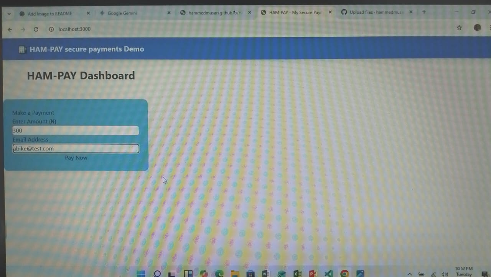

# HAM-PAY 💸
**A Multi-Currency Secure Payment Demo Interface**

HAM-PAY is a modern web application demo designed to simplify financial transactions. It features a clean user interface for processing payments, handling multiple currencies (including the Nigerian Naira ₦), and providing a seamless checkout experience.

---

## 🚀 Features
* **Multi-Currency Support:** Seamlessly switch between NGN, USD, and more.
* **Interactive UI:** Real-time fee calculation and responsive payment forms.
* **Secure Processing:** Built with Node.js and Express for robust backend handling.
* **Clean Design:** Minimalist "Fintech" style for better user experience.

---

## 🛠️ Tech Stack
* **Frontend:** HTML5, CSS3, JavaScript (ES6+)
* **Backend:** Node.js, Express.js
* **Template Engine:** EJS (or HTML)
* **API Integration:** [Not yet]

---

## 📦 Installation & Setup

1. **Clone the repository**
   ```bash
   git clone [https://github.com/hammedmusari/HAM-PAY.git](https://github.com/hammedmusari/HAM-PAY.git)
   cd ham-pay

   ## dependencies
   npm install
   ## run application
   npm start

## 📂 Project Structure
/public - Contains CSS files, images, and client-side JavaScript.

/views - Contains the UI templates (EJS/HTML).

/routes - Handles the application logic and URL paths.

app.js - The main entry point of the server.

## access the page via:
https://hammedmusari.github.io/HAM-PAY/

## HAM-PAY DASHBOARD SCREENSHOTS

